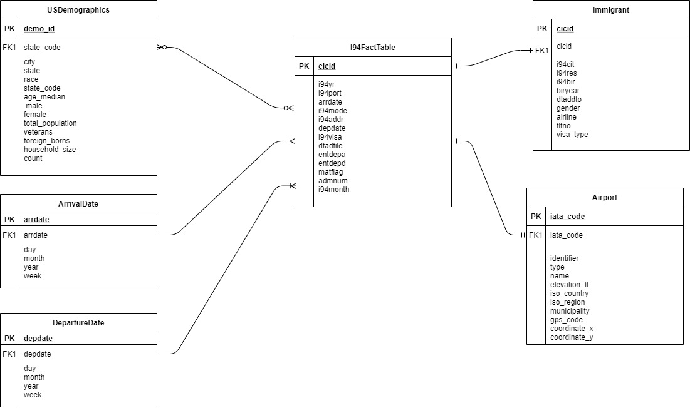

# Immigration Data Lake
### Data Engineering Capstone Project

#### Project Summary
The project aims to create a data lake for US immigration data and developing an ETL pipeline to build this data lake using I94 immigration data, airports data, global temperature data and US cities demographics. The raw data residing in various formats is extracted, transformed into a set of facts and dimensiona tables using Spark and loaded onto a S3 bucket for further analytics. This data can be used to study patterns in US immigration, like country of origin of most immigrants, age group, visa type, etc.

The project can be divided into the following steps:
* Step 1: Scope of the project, dataset description and reading data
* Step 2: Exploring and Assessing the Data
* Step 3: Define the Data Model
* Step 4: Run ETL to Model the Data
* Step 5: Complete Project Write Up

### Step 1: Scope of the Project, Data description and reading the data

#### Scope
The scope of this project can be described by the following steps:
1. Use spark and pandas to load the data.
2. Explore, analyze and clean all the datasets:
    - Airports Data
    - US cities demographics
    - World Temperature Data
    - I94 immigration Data
3. Evaluate the data requirements for analysis and design data model.
4. Design and develop the data model as a set of fact and dimensions tables.
5. Develop an ETL pipeline to build the data model on a S3 bucket.
6. Perform tests on data to ensure Data Quality.

Amazon S3 and Apache Spark are utilized to build the project.

#### Describe and Gather Data 
The data used in this project are:
1. I94 Immigration Data: This data comes from the US National Tourism and Trade Office. SAS file. 
    Source: https://travel.trade.gov/research/reports/i94/historical/2016.html
2. World Temperature Data: This dataset came from Kaggle. CSV file. 
    Source: https://www.kaggle.com/berkeleyearth/climate-change-earth-surface-temperature-data
3. U.S. City Demographic Data: This data comes from OpenSoft. CSV file. 
    Source: https://public.opendatasoft.com/explore/dataset/us-cities-demographics/export/
4. Airport Table: This is a simple table of airport codes and their details. CSV file. 
    Source: https://datahub.io/core/airport-codes#data
    
    
### Step 2: Exploring and Assessing the Data
#### Explore the Data
1. Visualize the data quality issues.
2. Identify data quality issues, like missing values and duplicate data.

#### Cleaning Steps
1. Delete columns with more than 30% missing values.
2. Delete rows having missing values where columns did not have more than 30% of the data as missing or if the column was necessary for the table.
3. Remove rows containing duplicate data.

### Step 3: Define the Data Model
#### 3.1 Conceptual Data Model
The conceptual data model can be seen below:

This data model was based on the star schema design with i94 data as the fact table and various dimension tables. This model offers efficient analysis of data for the US immigration patterns and provide essential dimension tables for more detailed information.
The immigrant dimension table provides all the personal details for an immigrant like gender, birth year, country of origin, etc. The airport dimension table can be utilized when more detail about an airport is needed like, city of the airport, its type, airport name, etc. US demographics dimension table can be utilized to gather information about demographics in all the cities of a particular state, for example female population, ethnicities, total population, etc., which can help in determining if there's a demographic pattern in states with higher number of immigrants. The arrival and departure dimension tables provide date, year, month and week of the arrival and departure dates.

#### 3.2 Mapping Out Data Pipelines
The steps necessary to pipeline the data into the chosen data model are:
1. Load the spark dataframe for airports using the cleaned dataset.
2. Create the Airport dimension table with IATA code as the primary key from airport dataframe, which can be linked to the I94 port of the I94 fact table.
3. Load the spark dataframe for US demographics using the cleaned dataset.
4. Create the US demographics dimension table with a Unique ID for each row from cities data frame, and it can be linked to the State code of the I94 fact table.
5. Load the immigration data frame.
6. Create the I94 fact table with all the essential fetures and cicid as the primary key from immigration dataframe.
7. Create the Immigrants dimension table with cicid as the primary key from immigration data frame, and it can be linked to the cicid column of the I94 fact table.
8. Create the arrival date dimension table with arrival date as the primary key and it lists out all the features of the date. It is created using the immigration data frame and can be linked to the arrdate column of the i94 fact table.
9. Create the departure date dimension table with departure date as the primary key and it lists out all the features of the date. It is created using the immigration data frame and can be linked to the depdate column of the i94 fact table.

### Step 4: Run Pipelines to Model the Data 
#### 4.1 Create the data model
Build the data pipelines to create the data model.

#### 4.2 Data Quality Checks
The data quality checks to be performed to ensure the pipeline runs as expected are:
1. Checking that there are no duplicates in the primary key of the table.
2. The primary/unique key does not contain null values.
3. Foreign keys can be mapped to the dimension tables.
4. Count the number of rows in the fact and dimension tables and check if that matches with the initial data to check the completeness of data.

#### 4.3 Data dictionary 
The data dictionary for the data model created can be seen below:

##### Airports Table
| Column Name   | Description                                               |
| ------------- | --------------------------------------------------------- |
| iata\_code    | 3 letter code for International Air Transport Association |
| identifier    | Identifier                                                |
| type          | Airport Type                                              |
| name          | Airport Name                                              |
| elevation\_ft | Elevation of the airport in feets                         |
| iso\_country  | Country                                                   |
| iso\_region   | Region                                                    |
| municipality  | Municipality                                              |
| gps\_code     | GPS code of the airport                                   |
| coordinatex   | x coordinate of the airport                               |
| coordinatey   | y coordinate of the airport                               |

##### US Demographics Table
| Column Name       | Description                            |
| ----------------- | -------------------------------------- |
| demo\_id          | Unique identifier for each row         |
| city              | City                                   |
| state             | State                                  |
| race              | Race                                   |
| state\_code       | 3 letter code for state                |
| age\_median       | Median age of the population           |
|  male             | Male population                        |
| female            | Female population                      |
| total\_population | Total population                       |
| veterans          | Number of veterans                     |
| foreign\_borns    | Number of Foreign borns in the region  |
| household\_size   | Household size                         |
| count             | Number of people in this configuration |

##### I94 Fact table
| Column Name | Description                                         |
| ----------- | --------------------------------------------------- |
| cicid       | Unique identifier                                   |
| i94yr       | 4 digit year                                        |
| i94port     | 3 character port of entry                           |
| arrdate     | Arrival date                                        |
| i94mode     | Mode of transportation                              |
| i94addr     | State code                                          |
| depdate     | Departure date                                      |
| i94visa     | Visa code with 3 categories                         |
| dtadfile    | Date added to I-94 Files                            |
| entdepa     | Arrival Flag - admitted or paroled into the U.S.    |
| entdepd     | Departure Flag - Departed, lost I-94 or is deceased |
| matflag     | Match flag - Match of arrival and departure records |
| admnum      | Admission number                                    |
| i94month    | Month                                               |

##### Immigrant Data
| Column Name | Description                                                                        |
| ----------- | ---------------------------------------------------------------------------------- |
| cicid       | Unique identifier                                                                  |
| i94cit      | Country of origin                                                                  |
| i94res      | Country of residence                                                               |
| i94bir      | Age of immigrant in years                                                          |
| biryear     | Birth year                                                                         |
| dtaddto     |  Date to which admitted to U.S. (allowed to stay until)                            |
| gender      | Gender                                                                             |
| airline     | Airline used to travel                                                             |
| fltno       | Flight number of the aircraft                                                      |
| visa\_type  | Class of admission legally admitting the non-immigrant to temporarily stay in U.S. |

##### Arrival date
| Column Name | Description  |
| ----------- | ------------ |
| arrdate     | Arrival Date |
| date        | Date         |
| month       | Month        |
| year        | Year         |
| week        | Week         |

##### Departure date
| Column Name | Description    |
| ----------- | -------------- |
| deptdate    | Departure date |
| date        | Date           |
| month       | Month          |
| year        | Year           |
| week        | Week           |

#### Step 5: Project Write Up
* The rationale for the choice of tools and technologies for the project.
    - Given the amount of data used in this project, i.e. millions of records of data, using Spark and Amazon S3 seem approprite to handle this efficiently and in a cost-effective way.
* How often the data should be updated and why.
    - The data should be updated monthly as the immigration records are updated every month.
* A description of the approach for the following scenarios:
 * The data was increased by 100x.
     - Amazon S3 and Spark can still be used to handle the data but the script can be run on an EMR cluster with more number of nodes. Moreover, data used for reading might also be required to move to an S3 bucket and EMR cluster can read it from there.
 * The data populates a dashboard that must be updated on a daily basis by 7am every day.
     - The data pipeline can be built on Airflow with daily schedule interval.
 * The database needed to be accessed by 100+ people.
     - Using S3 bucket should still work in this scenario, but we can consider using AWS redshift or EMR HDFS for better performance.